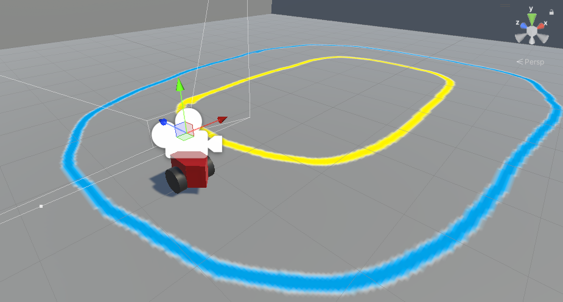

# Unity UGV Sim
A Unity simulation for differential robots.

## Scenes
**Differential Model** - Contains a simple differential model vehicle on a track indicated by blue and yellow boundaries. The vehicle is controlled using Twist messages under the `/cmd_vel` topic. The vehicle publishes wheel encoder data as a Twist message under the `/wheel_encoders` topic.

**Differential Model One Camera** - The same as the *Differential Model* scene with the addition of a front camera on the vehicle publishing image messages on the `/front_camera` topic.

**Differential Model Three Camera** - The same as the *Differential Model* scene with the addition of three cameras publishing image messages on the `/front_camera`, `/left_camera`, and `/right_camera` topics.

## Contact
Timothy Mead (timothy.mead20@gmail.com)